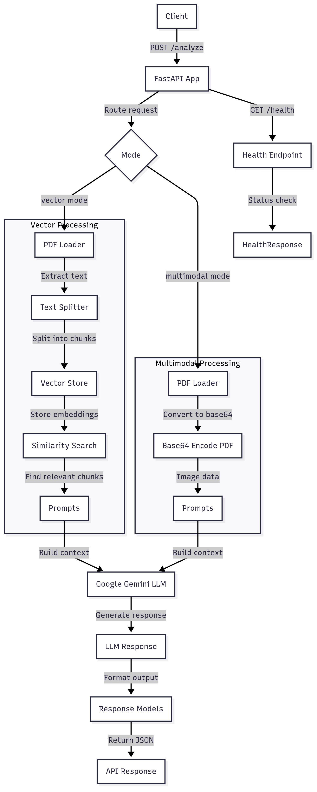
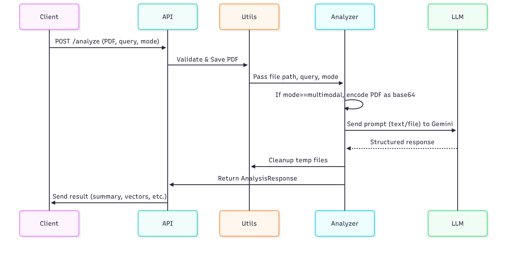

## Architecture Diagram


## PDF Analysis Flow






# PDF Analyzer API

## Base URL

```
http://localhost:${PORT:-8001}
```

## Endpoints

### Health Check

#### GET /

Returns the health status of the API service.

**Parameters:** None

**Example Request:**

```bash
curl -X GET http://localhost:${PORT:-8001}/
```

**Example Response:**

```json
{
  "status": "healthy"
}
```

**Status Codes:**

- `200 OK` - Service is healthy

---

### PDF Analysis

#### POST /analyze

Analyzes a PDF file and responds to search queries using either vector or multimodal analysis modes.

**Content-Type:** `multipart/form-data`

**Parameters:**

| Parameter      | Type   | Required | Default          | Description                               |
| -------------- | ------ | -------- | ---------------- | ----------------------------------------- |
| `file`         | File   | Yes      | -                | PDF file to analyze (multipart/form-data) |
| `search_query` | String | No       | "Summarize this" | Query to apply to the PDF content         |
| `mode`         | String | No       | "vector"         | Analysis mode: "vector" or "multimodal"   |

**Mode Differences:**

- **Vector Mode**: Uses Vector Embeddings for semantic search and returns relevant document chunks
- **Multimodal Mode**: Uses Vision capabilities

**Example Request (Vector Mode):**

```bash
curl -X POST http://localhost:${PORT:-8001}/analyze \
  -F "file=@/path/to/document.pdf" \
  -F "search_query=Summarize this document" \
  -F "mode=vector"

```

**Example Response (Vector Mode):**

```json
{
  "message": "PDF analyzed successfully",
  "mode": "vector",
  "search_query": "Summarize this document",
  "filename": "demo.pdf",
  "response": "This document outlines fundamental principles and elements of news writing, drawing insights from established journalism texts. It primarily focuses on two key news story structures and various factors that determine a story's newsworthiness...",
  "analysis_type": "vector",
  "retrieved_vectors": [
    {
      "page_content": "15\nILLUSTRATION NO. 2: INVERTED PYRAMID\nThe most important facts go here",
      "metadata": {
        "producer": "Microsoft: Print To PDF",
        "creator": "PyPDF",
        "creationdate": "2020-04-02T18:44:04+05:30",
        "author": "Test User",
        "moddate": "2020-04-02T18:44:04+05:30",
        "title": "MJM021.pdf",
        "source": "/tmp/tmpoqovezwk/demo.pdf",
        "total_pages": 13,
        "page": 8,
        "page_label": "9"
      }
    },
    {
      "page_content": "Content 2",
      "metadata": {
        "producer": "Microsoft: Print To PDF",
        "creator": "PyPDF",
        "creationdate": "2020-04-02T18:44:04+05:30",
        "author": "Test User",
        "moddate": "2020-04-02T18:44:04+05:30",
        "title": "MJM021.pdf",
        "source": "/tmp/tmpoqovezwk/demo.pdf",
        "total_pages": 13,
        "page": 9,
        "page_label": "10"
      }
    }
  ]
}
```

**Example Request (Multimodal Mode):**

```bash
curl -X POST http://localhost:${PORT:-8001}/analyze \
  -F "file=@/path/to/document.pdf" \
  -F "search_query=What are the key points?" \
  -F "mode=multimodal"
```

**Example Response (Multimodal Mode):**

```json
{
  "message": "PDF analyzed successfully",
  "mode": "multimodal",
  "search_query": "What are the key points?",
  "filename": "demo.pdf",
  "response": "## Key Points from the Document: \"UNIT 1 NEWS-DEFINITIONS, CONCEPT AND PRINCIPLES\"\n\nThis document provides a comprehensive overview of news, its definitions, core elements, and fundamental writing techniques...",
  "analysis_type": "multimodal",
  "retrieved_vectors": [] // Empty array for multimodal mode
}
```

---

### Vector Store Ingest

#### POST /vectorstore/ingest

Uploads a PDF file to be ingested into the persistent vector store. The file is saved in the `uploads/` directory with a unique filename (original name truncated if needed, an underscore, an 8-character UUID, and the extension, total length ≤ 32 characters).

**Content-Type:** `multipart/form-data`

**Parameters:**

| Parameter | Type | Required | Description |
|-----------|------|----------|-------------|
| `file`    | File | Yes      | PDF file to ingest |

**Example Request:**

```bash
curl -X POST http://localhost:${PORT:-8001}/vectorstore/ingest \
  -F "file=@/path/to/document.pdf"
```

**Example Response:**

```json
{
  "message": "PDF ingested and index updated.",
  "filename": "mydoc_1a2b3c4d.pdf"
}
```

---

### Vector Store Query

#### POST /vectorstore/query

Queries the persistent vector store for relevant document chunks. Each result includes the `source_path` (the file path in `uploads/` where the chunk originated).

**Content-Type:** `application/json`

**Parameters:**

| Parameter | Type   | Required | Default | Description |
|-----------|--------|----------|---------|-------------|
| `query`   | String | Yes      | -       | Query string |
| `k`       | Int    | No       | 4       | Number of results to return |

**Example Request:**

```bash
curl -X POST http://localhost:${PORT:-8001}/vectorstore/query \
  -H "accept: application/json" \
  -H "Content-Type: application/json" \
  -d '{"query": "What is the summary?", "k": 4}'
```

**Example Response:**

```json
{
  "results": [
    {
      "page_content": "This is a chunk of the document...",
      "metadata": {
        "producer": "Microsoft: Print To PDF",
        "creator": "PyPDF",
        "creationdate": "2020-04-02T18:44:04+05:30",
        "author": "Test User",
        "moddate": "2020-04-02T18:44:04+05:30",
        "title": "MJM021.pdf",
        "source": "uploads/mydoc_1a2b3c4d.pdf",
        "total_pages": 13,
        "page": 8,
        "page_label": "9",
        "source_path": "uploads/mydoc_1a2b3c4d.pdf"
      },
      "source_path": "uploads/mydoc_1a2b3c4d.pdf"
    }
  ]
}
```

---

**Status Codes:**

- `200 OK` - Analysis completed successfully
- `400 Bad Request` - Invalid mode or unsupported file type
- `422 Unprocessable Entity` - Missing required parameters
- `500 Internal Server Error` - Server-side processing errors

## Error Responses

### Invalid Analysis Mode

**Example Request:**

```bash
curl -X POST http://localhost:${PORT:-8001}/analyze \
  -F "file=@/path/to/document.pdf" \
  -F "search_query=Test query" \
  -F "mode=invalid_mode"
```

**Response:**

```json
{
  "detail": "Mode must be one of: vector, multimodal"
}
```

**Status Code:** `400 Bad Request`

### Missing File Parameter

**Example Request:**

```bash
curl -X POST http://localhost:${PORT:-8001}/analyze \
  -F "search_query=Test query" \
  -F "mode=vector"
```

**Response:**

```json
{
  "detail": [
    {
      "type": "missing",
      "loc": ["body", "file"],
      "msg": "Field required",
      "input": null
    }
  ]
}
```

**Status Code:** `422 Unprocessable Entity`

### Invalid File Type

**Example Request:**

```bash
curl -X POST http://localhost:${PORT:-8001}/analyze \
  -F "file=@/tmp/test.txt" \
  -F "search_query=Test query" \
  -F "mode=vector"
```

**Response:**

```json
{
  "detail": "Only PDF files are supported."
}
```

**Status Code:** `400 Bad Request`

## Response Schema

### Successful Analysis Response

```json
{
  "message": "string", // Success message
  "mode": "vector|multimodal", // Analysis mode used
  "search_query": "string", // Query used for analysis
  "filename": "string", // Name of analyzed file
  "response": "string", // LLM analysis result
  "analysis_type": "string", // Type of analysis performed
  "retrieved_vectors": [
    // Only present in vector mode
    {
      "page_content": "string", // Content of document chunk
      "metadata": {
        // Metadata about the chunk
        "producer": "string",
        "creator": "string",
        "creationdate": "string",
        "author": "string",
        "moddate": "string",
        "title": "string",
        "source": "string",
        "total_pages": "number",
        "page": "number",
        "page_label": "string"
      }
    }
  ]
}
```

### Health Response

```json
{
  "status": "string" // Status
}
```

### Error Response

```json
{
  "detail": "string" // Error message
}
```