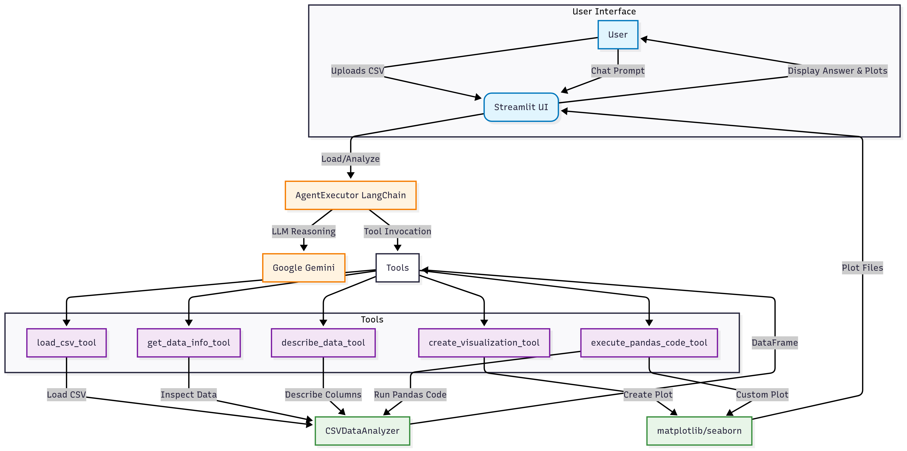

# CSV Analysis Agent

## Flow Diagram

## 

## Tools

| Tool Name                     | Functionality                                                             | Input Model        | Output Example                        |
| ----------------------------- | ------------------------------------------------------------------------- | ------------------ | ------------------------------------- |
| **load_csv_tool**             | Loads a CSV file and stores it for analysis                               | LoadCSVInput       | Success/error message, shape, columns |
| **get_data_info_tool**        | Returns shape, columns, dtypes, null counts, memory usage                 | DataInfoInput      | Dataset info summary                  |
| **describe_data_tool**        | Describes numeric/categorical columns, top values, stats                  | DescribeDataInput  | Numeric/categorical description       |
| **create_visualization_tool** | Generates plots (histogram, scatter, bar, box, heatmap) and saves as PNG  | VisualizationInput | Visualization filename or error       |
| **execute_pandas_code_tool**  | Runs custom pandas code securely, supports plotting, blocks dangerous ops | PandasCodeInput    | Code output, plot filename if any     |

### Tool Flow

- **Agent** (LangChain + Gemini) receives user prompt and chat history.
- **Agent** selects and invokes the appropriate tool(s) based on user request.
- **Tool** processes the request, interacts with the loaded DataFrame, and may generate plots.
- **Streamlit UI** displays results and any generated plots.

---

## Module Overview

- [`streamlit_app.py`](streamlit_app.py): Streamlit UI, handles file upload, chat, and plot display.
- [`src/agent.py`](src/agent.py): Creates the LangChain agent with Gemini LLM and tool suite.
- [`src/tools.py`](src/tools.py): Defines tools for loading CSVs, inspecting data, describing columns, creating visualizations, and executing pandas code.
- [`src/csv_analyzer.py`](src/csv_analyzer.py): Core logic for loading and storing CSV data.
- [`src/models.py`](src/models.py): Pydantic schemas for tool inputs.

---
