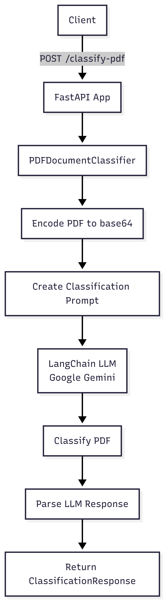
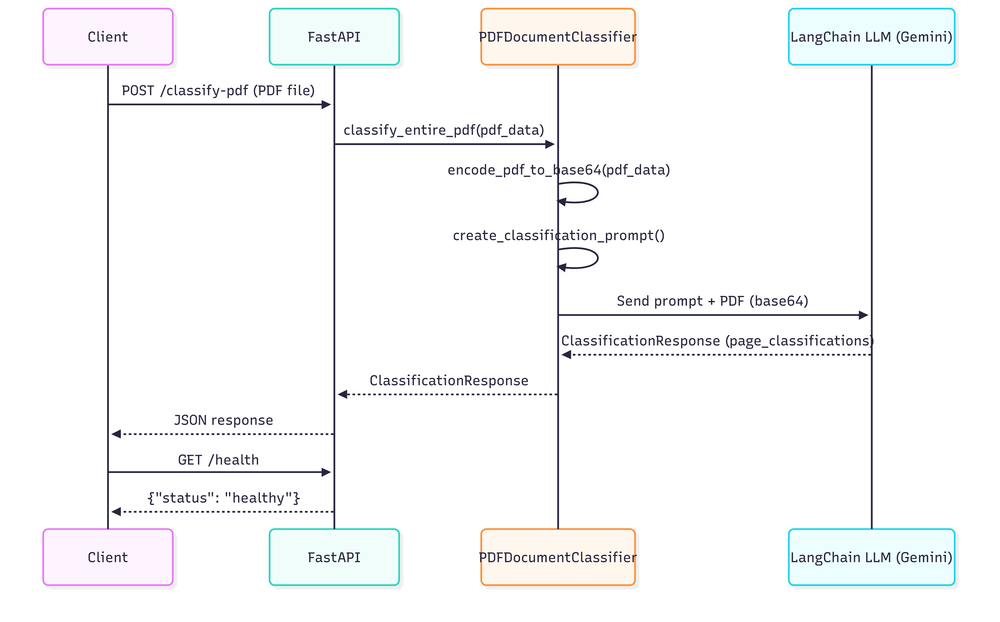

# PDF Document Classifier API

## Architecture



## Request Flow



## Base URL

```
http://localhost:${PORT:-8004}
```

## Endpoints

### Health Check

#### GET /

Returns the health status of the API service.

**Parameters:** None

**Example Request:**

```bash
curl -X GET http://localhost:${PORT:-8004}
```

**Example Response:**

```json
{
  "status": "healthy"
}
```

**Status Codes:**

- `200 OK` - Service is healthy

---

### Document Classification

#### POST /classify-pdf

**Content-Type:** `multipart/form-data`

**Parameters:**

| Parameter | Type | Required | Description |
| --------- | ---- | -------- | ----------- |
| `file`    | File | Yes      | PDF file to classify (multipart/form-data) |

**Example Request:**

```bash
curl -X POST http://localhost:${PORT:-8004}/classify-pdf \
  -F "file=@/path/to/document.pdf"
```

**Example Response:**

```json
{
  "page_classifications": [
    {
      "page": 1,
      "document_type": "Aadhaar Card",
      "confidence": 0.95,
      "reasoning": "Page contains Aadhaar card layout with UIDAI logo, 12-digit Aadhaar number format, and standard government ID design elements."
    },
    {
      "page": 2,
      "document_type": "PAN Card",
      "confidence": 0.92,
      "reasoning": "Page shows PAN card format with Income Tax Department logo, 10-character PAN number pattern, and official government card layout."
    },
    {
      "page": 3,
      "document_type": "Bank Statement",
      "confidence": 0.88,
      "reasoning": "Page contains bank statement format with account details, transaction history, and bank letterhead with official branding."
    }
  ]
}
```

**Status Codes:**

- `200 OK` - Classification completed successfully
- `400 Bad Request` - Invalid file type (non-PDF file)
- `422 Unprocessable Entity` - Missing required parameters
- `500 Internal Server Error` - Server-side processing errors


## Error Responses

### Invalid File Type

**Example Request:**

```bash
curl -X POST http://localhost:${PORT:-8004}/classify-pdf \
  -F "file=@/path/to/document.txt"
```

**Response:**

```json
{
  "detail": "File must be a PDF"
}
```

**Status Code:** `400 Bad Request`

### Missing File Parameter

**Example Request:**

```bash
curl -X POST http://localhost:${PORT:-8004}/classify-pdf
```

**Response:**

```json
{
  "detail": [
    {
      "type": "missing",
      "loc": ["body", "file"],
      "msg": "Field required",
      "input": null
    }
  ]
}
```

**Status Code:** `422 Unprocessable Entity`

### Processing Error

**Response:**

```json
{
  "detail": "Error processing PDF: [specific error message]"
}
```

**Status Code:** `500 Internal Server Error`

## Response Schema

### Successful Classification Response

```json
{
  "page_classifications": [
    {
      "page": "number",           // Page number (1-based)
      "document_type": "string",  // Identified document type
      "confidence": "number",     // Confidence score between 0 and 1
      "reasoning": "string"       // Explanation for the classification
    }
  ]
}
```

### Health Response

```json
{
  "status": "string"  // Healthy status of the service
}
```

### Error Response

```json
{
  "detail": "string"  // Error message
}
```

### Validation Error Response

```json
{
  "detail": [
    {
      "type": "string",    // Error type
      "loc": ["array"],    // Location of the error
      "msg": "string",     // Error message
      "input": "any"       // Input that caused the error
    }
  ]
}
```
