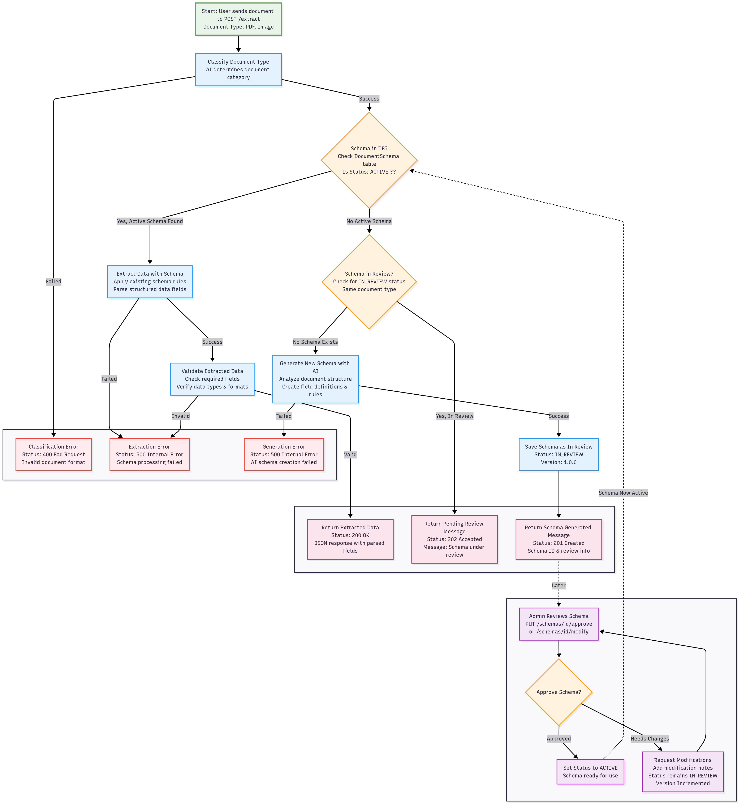

# Document Extraction API

## 🗂️ Architecture Diagram 




---

## Health

### GET /

Purpose: Check API health status.

Request Parameters: None

Example Request:

```bash
curl -X GET http://localhost:${PORT:-8005}
```

Example Response:

```json
{
	"status": "healthy"
}
```

Status Codes:

- 200: Service is healthy

---

## Extract

### POST /extract

Request Parameters:

| Name     | Type       | Required | Description                               |
| -------- | ---------- | -------- | ----------------------------------------- |
| document | UploadFile | Yes      | Multiple files supported (JPEG, PNG, PDF) |

Example Request:

```bash
curl -X POST 'http://localhost:${PORT:-8005}/extract' \
--form 'document=@"/path/to/document.pdf"' \
--form 'document=@"/path/to/document2.pdf"'
```

This schema is dynamic and will be generated based on the classification result.
Its general structure is fixed but the fields will vary based on the document type and country.
If the Schema for the document is not found, the system will attempt to classify the document type and country.
In this case, the response will be as follows:

```json
{
	"status": "schema_generated",
	"message": "Schema generated and saved for review Extraction not performed.",
	"classification": {
		"document_type": "residence_card",
		"country": "XX",
		"confidence": 0.95
	},
	"generated_schema": {
		"document_type": "residence_card",
		"country": "XX", // Country code in ISO 3166-1 alpha-2 format
		"confidence": 0.95, // Confidence level of the classification
		"schema": {
			"country_code": {
				"type": "string",
				"description": "The country code of the issuing country",
				"required": false,
				"example": "XX",
				"pattern": "^[A-Z]{2}$"
			},
			"document_header": {
				"type": "string",
				"description": "The main title of the document.",
				"required": false,
				"example": "DOCUMENT HEADER"
			},
			"document_number": {
				"type": "string",
				"description": "The unique document number of the residence card.",
				"required": false,
				"example": "DOC123456",
				"pattern": "^[A-Z]{3}d{6}$"
			},
			"surname": {
				"type": "string",
				"description": "The surname of the cardholder.",
				"required": false,
				"example": "SURNAME"
			},
			"given_names": {
				"type": "string",
				"description": "The given names of the cardholder.",
				"required": false,
				"example": "GIVEN NAMES"
			},
			"gender": {
				"type": "string",
				"description": "The gender of the cardholder (e.g., M for Male, F for Female).",
				"required": false,
				"example": "M",
				"pattern": "^[MFO]$"
			},
			"nationality": {
				"type": "string",
				"description": "The nationality of the cardholder.",
				"required": false,
				"example": "XXX",
				"pattern": "^[A-Z]{3}$"
			},
			"date_of_birth": {
				"type": "string",
				"description": "The date of birth of the cardholder in DD/MM/YYYY format.",
				"required": false,
				"example": "01/01/2000",
				"pattern": "^(0[1-9]|[12][0-9]|3[01])/(0[1-9]|1[0-2])/(\\d{4})$"
			},
			"expiry_date": {
				"type": "string",
				"description": "The expiry date of the residence card in DD/MM/YYYY format.",
				"required": false,
				"example": "01/01/2030",
				"pattern": "^(0[1-9]|[12][0-9]|3[01])/(0[1-9]|1[0-2])/(\\d{4})$"
			},
			"type_of_title": {
				"type": "string",
				"description": "The type of residence title or permit granted.",
				"required": false,
				"example": "TYPE OF TITLE"
			},
			"family_member_status": {
				"type": "string",
				"description": "Indicates the family member status, often related to EWR (European Economic Area) regulations.",
				"required": false,
				"example": "FAMILY MEMBER STATUS"
			},
			"article_reference": {
				"type": "string",
				"description": "The legal article reference pertaining to the residence status.",
				"required": false,
				"example": "ARTICLE REFERENCE"
			},
			"remarks_label": {
				"type": "string",
				"description": "The label for the remarks section, if present.",
				"required": false,
				"example": "REMARKS"
			},
			"document_footer": {
				"type": "string",
				"description": "The footer text of the document, typically in English.",
				"required": false,
				"example": "DOCUMENT FOOTER"
			},
			"card_number": {
				"type": "string",
				"description": "A secondary card number, usually found at the bottom right of the card.",
				"required": false,
				"example": "000001",
				"pattern": "^\\d{6}$"
			},
			"photo_present": {
				"type": "boolean",
				"description": "Boolean indicating if a photograph of the cardholder is visible.",
				"required": false,
				"example": true
			},
			"signature_present": {
				"type": "boolean",
				"description": "Boolean indicating if a signature of the cardholder is visible.",
				"required": false,
				"example": true
			},
			"information_unreadable": {
				"type": "boolean",
				"description": "Set to true if any required information is missing or unreadable.",
				"required": true,
				"example": false
			},
			"is_document_correct": {
				"type": "boolean",
				"description": "Set to true if the document appears to be a valid residence card.",
				"required": true,
				"example": true
			}
		}
	},
	"schema_id": "SCHEMA_ID"
}
```

Example Response (Extracted):

```json
{
	"status": "extracted",
	"data": {
		"country_code": "XX",
		"document_header": "DOCUMENT HEADER",
		"document_number": "DOC123456",
		"surname": "SURNAME",
		"given_names": "GIVEN NAMES",
		"gender": "M",
		"nationality": "XXX",
		"date_of_birth": "01 01 2000",
		"expiry_date": "01 01 2030",
		"type_of_title": "TYPE OF TITLE",
		"family_member_status": "FAMILY MEMBER STATUS",
		"article_reference": "ARTICLE REFERENCE",
		"remarks_label": "REMARKS",
		"document_footer": "DOCUMENT FOOTER",
		"card_number": "000001",
		"photo_present": true,
		"signature_present": true,
		"information_unreadable": false,
		"is_document_correct": true
	},
	"classification": {
		"document_type": "residence_card",
		"country": "XX",
		"confidence": 0.95
	},
	"schema_used": {
		"document_type": "residence_card",
		"country": "XX",
		"version": 1
	}
}
```

Status Codes:

- 200: Extraction successful
- 400: Bad request (missing/invalid file, unsupported type, classification failed)
- 422: Classification confidence too low
- 500: Internal error

Error Examples:

```json
{
	"detail": [
		{
			"type": "missing",
			"loc": ["body", "document"],
			"msg": "Field required",
			"input": null
		}
	]
}
```

```json
{
	"detail": "Unable to classify document type"
}
```

---

## Schemas

### GET /schemas

Purpose: List all document schemas in the system.

Request Parameters: None

Example Request:

```bash
curl -X GET http://localhost:${PORT:-8005}/schemas
```

Example Response:

```json
{
	"schemas": [
		{
			// Schema 1
		},
		{
			// Schema 2
		}
		// Additional schemas
	],
	"total_count": 2
}
```

Status Codes:

- 200: Success
- 500: Internal error

Error Examples:

```json
{
	"detail": "Failed to retrieve schemas: [error details]"
}
```

---

### PUT /schemas/{schema_id}/approve

Purpose: Approve a schema currently in review, making it active.

Request Parameters:

| Name      | Type   | Required | Description                |
| --------- | ------ | -------- | -------------------------- |
| schema_id | string | Yes      | Schema ID (path parameter) |

Example Request:

```bash
curl -X PUT http://localhost:${PORT:-8005}/schemas/SCHEMA_ID/approve
```

Example Response:

```json
{
	"message": "Schema approved successfully",
	"schema": {
		"id": "SCHEMA_ID",
		"document_type": "Document Type",
		"country": "XX",
		"status": "active",
		"version": 1,
		"updated_at": "2020-01-01T00:00:00.000000"
	},
	"deprecated_schema": null
}
```

Example Response (Error):

```json
{
	"detail": "Failed to approve schema: 404: Schema not found"
}
```

```json
{
    "detail": "Failed to approve schema: 400: Schema must be in IN_REVIEW status to approve"
}
```

Status Codes:

- 200: Success
- 404: Schema not found
- 500: Internal error

---

### PUT /schemas/{schema_id}/modify
Purpose: Propose modifications to the latest schema version.

Request Parameters:

| Name      | Type      | Required | Description                       |
|-----------|-----------|----------|-----------------------------------|
| schema_id | string    | Yes      | Schema ID (path parameter)        |
| request   | JSON body | Yes      | Modifications and description     |

Example Request:

```bash
curl --location --request PUT 'http://localhost:${PORT:-8005}/schemas/SCHEMA_ID/modify' \
--header 'Content-Type: application/json' \
--data-raw '{
    "modifications": {
        "mobile_number": {
            "type": "string",
            "description": "Mobile phone number of the cardholder",
            "required": false,
            "example": "+123-456789012",
            "pattern": "^[+]?123[0-9]{9}$"
        },
        "email_address": {
            "type": "string",
            "description": "Email address of the cardholder",
            "required": false,
            "example": "user@example.com"
        },
        "address": {
            "type": "string",
            "description": "Residential address of the cardholder",
            "required": false,
            "example": "123 Main Street, City, 12345"
        }
    },
    "change_description": "Added mobile_number, email_address, and address fields to capture contact details of the residence card holder"
}'
```

Response Structure:

```json
{
  "status": "schema_modified",
  "message": "Schema successfully modified and saved",
  "original_schema_info": {
    "id": "OLDER_SCHEMA_ID",
    "version": 2,
    "status": "deprecated"
  },
  "new_schema_info": {
    "id": "NEW_SCHEMA_ID",
    "document_type": "residence_card",
    "country": "XX",
    "status": "in_review",
    "version": 3,
    "created_at": "2020-01-01T00:00:00.000000",
    "updated_at": "2020-01-01T00:00:00.000000"
  },
  "modification_details": {
    "schema_id": "NEW_SCHEMA_ID",
    "current_version": 2,
    "proposed_version": 3,
    "changes": [
      {
        "change_type": "field_added",
        "field_name": "mobile_number",
        "old_value": null,
        "new_value": {
          "type": "string",
          "description": "Mobile phone number of the cardholder",
          "required": false,
          "example": "+123-456789012"
        }
      },
      {
        "change_type": "field_added",
        "field_name": "email_address",
        "old_value": null,
        "new_value": {
          "type": "string",
          "description": "Email address of the cardholder",
          "required": false,
          "example": "user@example.com"
        }
      },
      {
        "change_type": "field_added",
        "field_name": "address",
        "old_value": null,
        "new_value": {
          "type": "string",
          "description": "Residential address of the cardholder",
          "required": false,
          "example": "123 Main Street, City, 12345"
        }
      }

    ],
    "original_schema": {
      // Older Schema
    },
    "modified_schema": {
      // Newer Schema with the modifications
    },
    "change_summary": "Added 3 field(s): mobile_number, email_address, address",
    "modification_metadata": {
      "modification_timestamp": "2025-07-17T07:11:17.247894+00:00",
      "total_changes": 3,
      "change_types": {
        "added": 3,
        "updated": 0,
        "removed": 0
      },
      "change_description": "Added mobile_number, email_address, and address fields to capture contact details of the residence card holder",
      "affected_fields": [
        "mobile_number",
        "email_address",
        "address"
      ]
    }
  },
  "note": "Changes have been saved to the database"
}
```

The status for older schema will be set to DEPRECATED and the new schema will be set to IN_REVIEW.

The newer schema will have the same document_type and country as the older schema, but with an incremented version number.


To remove a field, set its value to `null` in the modifications object.
Example Request (Remove Field):

```bash
curl --location --request PUT 'http://localhost:${PORT:-8005}/schemas/SCHEMA_ID/modify' \
--header 'Content-Type: application/json' \
--header 'Accept: application/json' \
--data '{
    "modifications": {
      "email_address": null
    },
    "change_description": "Remove email_address field from schema "
  }'
```


Example Response (Error):

```json
{
    "detail": "Failed to apply schema modification: 404: Schema not found"
}
```

If Older Schema is modified, the response will be:

```json
{
  "detail": "Failed to apply schema modification: 400: Cannot modify schema version, only the latest version can be modified. Latest schema ID: LATEST_SCHEMA_ID"
}
```

Status Codes:

- 200: No changes detected
- 201: Schema modified
- 404: Schema not found
- 500: Internal error
