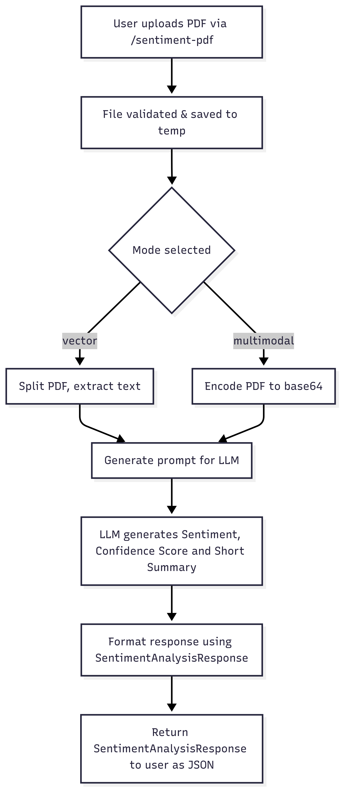

# PDF Sentiment Analysis API

## Flow Diagram



## Base URL

```
http://localhost:${PORT:-8002}
```

## Endpoints

### Health Check

#### GET /

Returns the health status of the API service.

**Parameters:** None

**Example Request:**

```bash
curl -X GET http://localhost:${PORT:-8002}/
```

**Example Response:**

```json
{
  "status": "healthy"
}
```

**Status Codes:**

- `200 OK` - Service is healthy

---

### PDF Sentiment Analysis

#### POST /sentiment-pdf

Performs multimodal or vector-based sentiment analysis on a provided PDF file.

**Content-Type:** `multipart/form-data`

**Parameters:**

| Parameter | Type   | Required | Default       | Description                                      |
| --------- | ------ | -------- | ------------- | ------------------------------------------------ |
| `file`    | File   | Yes      | -             | PDF file to analyze (multipart/form-data)       |
| `mode`    | String | No       | "multimodal"  | Analysis mode: "vector" or "multimodal"          |

**Mode Differences:**

- **Vector Mode**: Uses text-based vector embeddings for sentiment analysis
- **Multimodal Mode**: Uses vision capabilities to analyze PDF content including images and visual elements

**Example Request (Multimodal Mode):**

```bash
curl -X POST http://localhost:${PORT:-8002}/sentiment-pdf \
  -F "file=@/path/to/document.pdf" \
  -F "mode=multimodal"
```

**Example Response (Multimodal Mode):**

```json
{
  "message": "PDF sentiment analyzed successfully",
  "mode": "multimodal",
  "filename": "document.pdf",
  "result": {
    "sentiment": "positive",
    "score": 0.85,
    "summary": "The document expresses predominantly positive sentiment with optimistic language and constructive recommendations throughout the content."
  }
}
```

**Example Request (Vector Mode):**

```bash
curl -X POST http://localhost:${PORT:-8002}/sentiment-pdf \
  -F "file=@/path/to/document.pdf" \
  -F "mode=vector"
```

**Example Response (Vector Mode):**

```json
{
  "message": "PDF sentiment analyzed successfully",
  "mode": "vector",
  "filename": "document.pdf",
  "result": {
    "sentiment": "neutral",
    "score": 0.72,
    "summary": "The document maintains a neutral tone with balanced presentation of facts and minimal emotional language."
  }
}
```

**Status Codes:**

- `200 OK` - Analysis completed successfully
- `400 Bad Request` - Invalid mode or unsupported file type
- `422 Unprocessable Entity` - Missing required parameters
- `500 Internal Server Error` - Server-side processing errors

## Error Responses

### Invalid Analysis Mode

**Example Request:**

```bash
curl -X POST http://localhost:${PORT:-8002}/sentiment-pdf \
  -F "file=@/path/to/document.pdf" \
  -F "mode=invalid_mode"
```

**Response:**

```json
{
  "detail": [
    {
      "type": "string_pattern_mismatch",
      "loc": [
        "body",
        "mode"
      ],
      "msg": "String should match pattern '^(vector|multimodal)$'",
      "input": "invalid",
      "ctx": {
        "pattern": "^(vector|multimodal)$"
      }
    }
  ]
}
```

**Status Code:** `400 Bad Request`

### Missing File Parameter

**Example Request:**

```bash
curl -X POST http://localhost:${PORT:-8002}/sentiment-pdf \
  -F "mode=vector"
```

**Response:**

```json
{
  "detail": [
    {
      "type": "missing",
      "loc": ["body", "file"],
      "msg": "Field required",
      "input": null
    }
  ]
}
```

**Status Code:** `422 Unprocessable Entity`

### Invalid File Type

**Example Request:**

```bash
curl -X POST http://localhost:${PORT:-8002}/sentiment-pdf \
  -F "file=@/tmp/test.txt" \
  -F "mode=vector"
```

**Response:**

```json
{
  "detail": "Only PDF files are supported."
}
```

**Status Code:** `400 Bad Request`

### Analysis Failed

**Response:**

```json
{
  "detail": "Analysis failed: [specific error message]"
}
```

**Status Code:** `500 Internal Server Error`

## Response Schema

### Successful Sentiment Analysis Response

```json
{
  "message": "string", // Success message
  "mode": "vector|multimodal", // Analysis mode used
  "filename": "string", // Name of analyzed file
  "result": {
    "sentiment": "string", // One of 'positive', 'negative', or 'neutral'
    "score": "number", // Confidence score between 0 and 1
    "summary": "string" // Brief explanation of the sentiment determination
  }
}
```

### Health Response

```json
{
  "status": "string" // Status message
}
```

### Error Response

```json
{
  "detail": "string" // Error message
}
```

### Validation Error Response

```json
{
  "detail": [
    {
      "type": "string", // Error type
      "loc": ["array"], // Location of the error
      "msg": "string", // Error message
      "input": "any", // Input that caused the error
      "ctx": {
        "pattern": "string" // Contextual information like regex pattern
      }
    }
  ]
}
