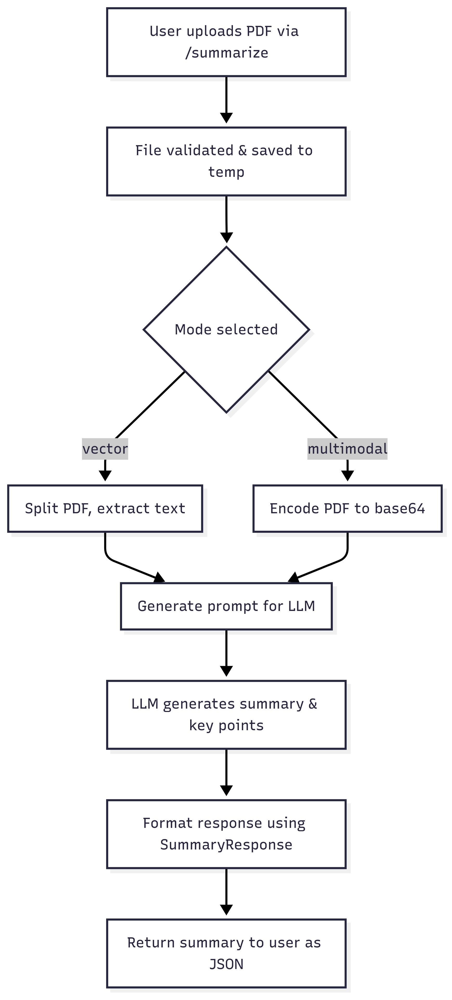

# PDF Summarizer API

## Flow Diagram



## Base URL

```
http://localhost:${PORT:-8003}
```

## Endpoints

### Health Check

#### GET /

Returns the health status of the API service.

**Parameters:** None

**Example Request:**

```bash
curl -X GET http://localhost:${PORT:-8003}/
```

**Example Response:**

```json
{
  "status": "healthy"
}
```

**Status Codes:**

- `200 OK` - Service is healthy

---

### PDF Summarization

#### POST /summarize

Performs PDF summarization using either vector-based or multimodal analysis with different summary types.

**Content-Type:** `multipart/form-data`

**Parameters:**

| Parameter      | Type   | Required | Default         | Description                                           |
| -------------- | ------ | -------- | --------------- | ----------------------------------------------------- |
| `file`         | File   | Yes      | -               | PDF file to summarize (multipart/form-data)           |
| `mode`         | String | No       | "vector"        | Analysis mode: "vector" or "multimodal"               |
| `summary_type` | String | No       | "comprehensive" | Summary type: "comprehensive", "brief", or "detailed" |

**Mode Differences:**

- **Vector Mode**: Uses text-based vector embeddings for summarization
- **Multimodal Mode**: Uses vision capabilities to analyze PDF content including images and visual elements

**Summary Type Differences:**

- **Comprehensive**: Balanced
- **Brief**: Concise
- **Detailed**: In Depth

#### Vector Mode Examples

**Example Request (Vector + Comprehensive):**

```bash
curl -X POST http://localhost:${PORT:-8003}/summarize \
  -F "file=@/path/to/document.pdf" \
  -F "mode=vector" \
  -F "summary_type=comprehensive"
```

**Example Response (Vector + Comprehensive):**

```json
{
  "message": "PDF summarized successfully",
  "mode": "vector",
  "summary_type": "comprehensive",
  "filename": "document.pdf",
  "summary": "Summary in Comprehensive manner.",
  "key_points": ["Point 1", "Point 2", "Point 3", "Point 4", "Point 5"]
}
```

**Example Request (Vector + Brief):**

```bash
curl -X POST http://localhost:${PORT:-8003}/summarize \
  -F "file=@/path/to/document.pdf" \
  -F "mode=vector" \
  -F "summary_type=brief"
```

**Example Response (Vector + Brief):**

```json
{
  "message": "PDF summarized successfully",
  "mode": "vector",
  "summary_type": "brief",
  "filename": "document.pdf",
  "summary": "Summary in Brief manner.",
  "key_points": ["Point 1", "Point 2", "Point 3"]
}
```

**Example Request (Vector + Detailed):**

```bash
curl -X POST http://localhost:${PORT:-8003}/summarize \
  -F "file=@/path/to/document.pdf" \
  -F "mode=vector" \
  -F "summary_type=detailed"
```

**Example Response (Vector + Detailed):**

```json
{
  "message": "PDF summarized successfully",
  "mode": "vector",
  "summary_type": "detailed",
  "filename": "document.pdf",
  "summary": "Summary in Detailed manner.",
  "key_points": [
    "Point 1",
    "Point 2",
    "Point 3",
    "Point 4",
    "Point 5",
    "Point 6",
    "Point 7",
    "Point 8",
    "Point 9"
  ]
}
```

#### Multimodal Mode Examples

**Example Request (Multimodal + Comprehensive):**

```bash
curl -X POST http://localhost:${PORT:-8003}/summarize \
  -F "file=@/path/to/document.pdf" \
  -F "mode=multimodal" \
  -F "summary_type=comprehensive"
```

**Example Response (Multimodal + Comprehensive):**

```json
{
  "message": "PDF summarized successfully",
  "mode": "multimodal",
  "summary_type": "comprehensive",
  "filename": "document.pdf",
  "summary": "Summary in Comprehensive manner.",
  "key_points": ["Point 1", "Point 2", "Point 3", "Point 4", "Point 5"]
}
```

**Example Request (Multimodal + Brief):**

```bash
curl -X POST http://localhost:${PORT:-8003}/summarize \
  -F "file=@/path/to/document.pdf" \
  -F "mode=multimodal" \
  -F "summary_type=brief"
```

**Example Response (Multimodal + Brief):**

```json
{
  "message": "PDF summarized successfully",
  "mode": "multimodal",
  "summary_type": "brief",
  "filename": "document.pdf",
  "summary": "Summary in Brief manner.",
  "key_points": ["Point 1", "Point 2", "Point 3"]
}
```

**Example Request (Multimodal + Detailed):**

```bash
curl -X POST http://localhost:${PORT:-8003}/summarize \
  -F "file=@/path/to/document.pdf" \
  -F "mode=multimodal" \
  -F "summary_type=detailed"
```

**Example Response (Multimodal + Detailed):**

```json
{
  "message": "PDF summarized successfully",
  "mode": "multimodal",
  "summary_type": "detailed",
  "filename": "document.pdf",
  "summary": "Summary in Detailed manner.",
  "key_points": [
    "Point 1",
    "Point 2",
    "Point 3",
    "Point 4",
    "Point 5",
    "Point 6",
    "Point 7",
    "Point 8",
    "Point 9"
  ]
}
```

**Status Codes:**

- `200 OK` - Summarization completed successfully
- `400 Bad Request` - Invalid mode, summary type, or unsupported file type
- `422 Unprocessable Entity` - Missing required parameters
- `500 Internal Server Error` - Server-side processing errors

## Error Responses

### Invalid Analysis Mode

**Example Request:**

```bash
curl -X POST http://localhost:${PORT:-8003}/summarize \
  -F "file=@/path/to/document.pdf" \
  -F "mode=invalid_mode"
```

**Response:**

```json
{
  "detail": "Mode must be one of: vector, multimodal"
}
```

**Status Code:** `400 Bad Request`

### Invalid Summary Type

**Example Request:**

```bash
curl -X POST http://localhost:${PORT:-8003}/summarize \
  -F "file=@/path/to/document.pdf" \
  -F "summary_type=invalid_type"
```

**Response:**

```json
{
  "detail": "Summary type must be one of: comprehensive, brief, detailed"
}
```

**Status Code:** `400 Bad Request`

### Missing File Parameter

**Example Request:**

```bash
curl -X POST http://localhost:${PORT:-8003}/summarize \
  -F "mode=vector"
```

**Response:**

```json
{
  "detail": [
    {
      "type": "missing",
      "loc": ["body", "file"],
      "msg": "Field required",
      "input": null
    }
  ]
}
```

**Status Code:** `422 Unprocessable Entity`

### Invalid File Type

**Example Request:**

```bash
curl -X POST http://localhost:${PORT:-8003}/summarize \
  -F "file=@/tmp/test.txt" \
  -F "mode=vector"
```

**Response:**

```json
{
  "detail": "Only PDF files are supported."
}
```

**Status Code:** `400 Bad Request`

### Summarization Failed

**Response:**

```json
{
  "detail": "Summarization failed: Unable to extract text from PDF file"
}
```

**Status Code:** `500 Internal Server Error`

### Missing API Key

**Response:**

```json
{
  "detail": "Summarization failed: Google API key not configured"
}
```

**Status Code:** `500 Internal Server Error`

## Response Schema

### Successful Summarization Response

```json
{
  "message": "string", // Success message
  "mode": "vector|multimodal", // Analysis mode used
  "summary_type": "comprehensive|brief|detailed", // Summary type used
  "filename": "string", // Name of summarized file
  "summary": "string", // Generated summary of the document
  "key_points": ["string"] // Array of key points extracted from the document
}
```

### Health Response

```json
{
  "status": "string" // Status message
}
```

### Error Response

```json
{
  "detail": "string" // Error message
}
```

### Validation Error Response

```json
{
  "detail": [
    {
      "type": "string", // Error type
      "loc": ["array"], // Location of the error
      "msg": "string", // Error message
      "input": "any" // Input that caused the error
    }
  ]
}
```
